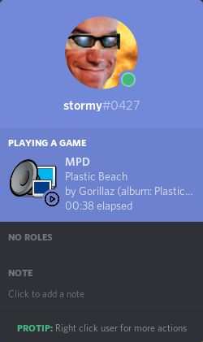
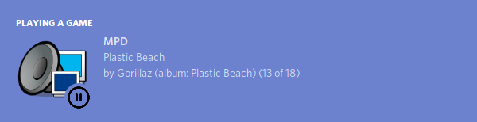
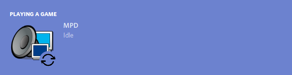
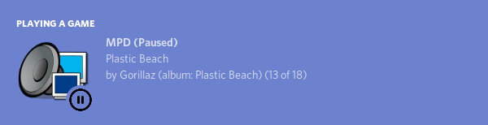

    

<h1 align="center">
    <a href="https://github.com/SSStormy/mpd-rich-presence-discord">MPD Rich Presence for Discord</a>
</h1>

    <b>Broadcast MPD state via Discord Rich Presence</b>

  <b>AUR:</b>
  
  
  
  
  
  
  <dl>
    <dt><a href="#images">Images</a></dt>
    <dd><a href="#single-app-mode">Single App Mode</a></dd>
    <dd><a href="#multi-app-mode">Multi App Mode</a></dd>
    <dt><a href="#multi-app-vs-single-app-mode">Multi App vs Single App Mode</a></dt>
    <dt><a href="#command-line-arguments">Command Line Arguments</a></dt>
    <dt><a href="#compiling">Compiling</a></dt>
    <dt><a href="#similar">Similar</a></dt>
    <dt><link href="https://fonts.googleapis.com/css?family=Cookie" rel="stylesheet"><a class="bmc-button" target="_blank" href="https://www.buymeacoffee.com/stormy">Buy me a coffee</a></dt>
  </dl>

---

## Images

### Single App Mode
| State | Image |
| :-: | :-: |
| Playing | 
| Paused | 
| Idle | 

### Multi App Mode

| State | Image |
| :-: | :-: |
| Playing | 
| Paused | 
| Idle | 

---

## Multi App vs Single App Mode
* Single App Mode

  * This mode will only use a single MPD app, which will diplay the three different MPD states. (Playing, Paused and Idle)
  * This mode syncs faster than the multi-app mode.
  
* Multi App Mode

  * This mode will use multiple, unique MPD apps: 
    * `MPD (Playing)`
    * `MPD (Paused)`
    * `MPD` (Reserved for idle)
  
  * These app names will show up next to your name on the sidebar.
  
  * This mode updates slower than the single app mode.

---

## Command Line Arguments

Example: `mpd_discord_richpresence -h=211.111.111.112 -P=password -p=6606 --fork --no-idle --use-multiple-apps`

| Paramater| Purpose  |
|--|--|
|`-h=ADDDRESS`|The listen-address for MPD. (Defaults to `127.0.0.1`)|
|`-p=PORT`|The port which MPD is listening on. (Defaults to `6600`)|
|`-P=PASSWORD`|The password sent to MPD after the connection has been established successfully. (Default is empty, therefore no password sent.)|
|`--fork`|Forks the process into the background.|
|`--no-idle`|Disables broadcasting of the idle state.|
|`--use-multiple-apps`|Uses the Multi-App mode.|

---

## Compiling

### Dependencies
* pthread
* [discord-rpc](https://github.com/discordapp/discord-rpc)
* libmpdclient

A [build script](build.sh) is included.

The CMakeFile will take care of finding discord-rpc. If it cannot find it, it will pull the discord-rpc GitHub repo and compile from source.

---

## Similar

* [mpv-discordRPC, noaione](https://github.com/noaione/mpv-discordRPC) - MPV
* [foo_discord, NaamloosDT/](https://github.com/NaamloosDT/foo_discord) - foobar2000 rich presence
